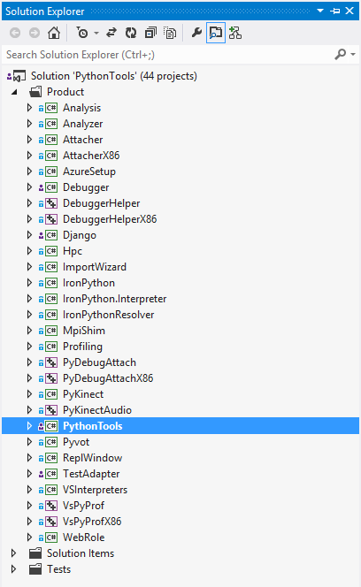
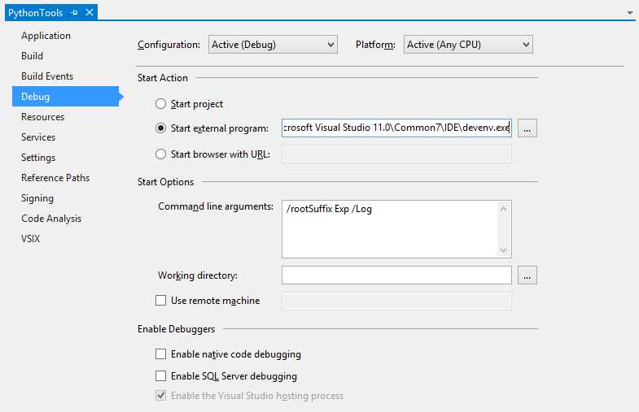
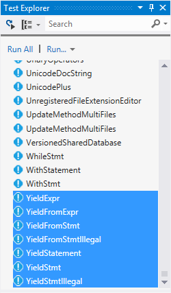

To build PTVS on your own PC, for example to pick up the latest bug fixes, make modifications, or contribute back to the project, please use the following instructions.

## Cloning

First, you will require a local copy of our Git repository. It can be cloned from [https://github.com/Microsoft/PTVS.git](https://github.com/Microsoft/PTVS.git). (If you’re behind a corporate firewall you may need to enter your proxy settings.)

If you intend to contribute back to PTVS, you will need to [Create a Fork](https://github.com/Microsoft/PTVS#fork-destination-box) and use the source URL provided there.

## Prerequisites

The following list of software is required in order to build PTVS from source. All of these are required for a complete build, though a complete build is not required to be able to contribute. The next section outlines the projects that may be omitted when building PTVS.

Note that you need a version of either Microsoft Visual Studio 2010, 2012, or 2013. You'll need VS 2010 to build PTVS for VS 2010, and VS 2012 to build PTVS for VS 2012, etc. Instructions in this document describe how to build using VS 2012.

<table border="1" cellspacing="0" cellpadding="0">
<tbody>
<tr>
<td valign="top" width="145">

<strong>Software</strong>

</td>
<td valign="top" width="481">

<strong>Download</strong>

</td>
</tr>
<tr>
<td valign="top" width="145">

Microsoft Visual Studio 2010/2012/2013 Professional or higher

</td>
<td valign="top" width="481">

Free trials: <a href="http://www.microsoft.com/visualstudio/eng/downloads">http://www.microsoft.com/visualstudio/eng/downloads</a>

</td>
</tr>
<tr>
<td valign="top" width="145">

Microsoft Visual Studio 2010 Service Pack 1

</td>
<td valign="top" width="481">

<a href="http://www.microsoft.com/en-us/download/details.aspx?id=23691">http://www.microsoft.com/en-us/download/details.aspx?id=23691</a>

</td>
</tr>
<tr>
<td valign="top" width="145">

Microsoft Visual Studio SDK

</td>
<td valign="top" width="481">

VS 2013: <a href="http://www.microsoft.com/visualstudio/eng/downloads#d-vs-sdk">
http://www.microsoft.com/visualstudio/eng/downloads#d-vs-sdk</a> 
VS 2012: <a href="http://www.microsoft.com/en-us/download/details.aspx?id=30668">
http://www.microsoft.com/en-us/download/details.aspx?id=30668</a> 
VS 2010: <a href="http://www.microsoft.com/en-us/download/details.aspx?id=21835">
http://www.microsoft.com/en-us/download/details.aspx?id=21835</a>

</td>
</tr>
<tr>
<td valign="top" width="145">

Microsoft Visual Studio 2010 Standalone Profiler

</td>
<td valign="top" width="481">

<a href="http://www.microsoft.com/en-us/download/details.aspx?id=23205">http://www.microsoft.com/en-us/download/details.aspx?id=23205</a>&nbsp; 
(required for VS 2010 Professional only)

</td>
</tr>
<tr>
<td valign="top" width="145">

Microsoft .NET Framework 3.5 SP1

</td>
<td valign="top" width="481">

<a href="http://www.microsoft.com/en-us/download/details.aspx?id=22">http://www.microsoft.com/en-us/download/details.aspx?id=22</a>

</td>
</tr>
<tr>
<td valign="top" width="145">

Microsoft HPC Pack 2008 R2 Client Utilities

</td>
<td valign="top" width="481">

<a href="http://www.microsoft.com/en-us/download/details.aspx?id=17017">http://www.microsoft.com/en-us/download/details.aspx?id=17017</a> 
(optional)

</td>
</tr>
<tr>
<td valign="top" width="145">

Microsoft HPC SDK

</td>
<td valign="top" width="481">

<a href="http://www.microsoft.com/en-us/download/details.aspx?id=12218">http://www.microsoft.com/en-us/download/details.aspx?id=12218</a> 
(optional)

</td>
</tr>
<tr>
<td valign="top" width="145">

Microsoft Kinect SDK

</td>
<td valign="top" width="481">

<a href="http://www.microsoft.com/en-us/kinectforwindows/develop/overview.aspx">http://www.microsoft.com/en-us/kinectforwindows/develop/overview.aspx</a> 
(optional)

</td>
</tr>
<tr>
<td valign="top" width="145">

Windows Azure SDK for Python

</td>
<td valign="top" width="481">

<a href="https://www.windowsazure.com/en-us/develop/python/">https://www.windowsazure.com/en-us/develop/python/</a> 
(optional)

</td>
</tr>
</tbody>
</table>

Be aware that the Windows Azure SDK for Python installer will install the latest release of PTVS. A system-wide PTVS installation may interfere with the build process, so you should remove it from the list of packages to install (or uninstall it later).

Some other prerequisites are included with the source code:

Our automated tests use a separately installed tool for controlling Visual Studio. These can be installed by running **Prerequisites\VSTestHost.msi** for VS 2013, VS 2012, and VS 2010.

Finally you'll need to disable strong name verification for the Python Tools binaries. This can be done by merging the **Prerequisites\EnableSkipVerification.reg** file (or **Prerequisites\EnableSkipVerificationX86.reg**, depending on your own system).  This will install registry keys which disable strong name verification for the assemblies built by PTVS.  If you also want to use the installer you may need to stop and restart the Windows Installer service (from an elevated command prompt, type **net stop "Windows Installer"** and then **net start "Windows Installer"**).

### Optional Projects

Visual Studio 2010 Professional requires the Standalone Profiler to build the **Profiling, VsPyProf, VsPyProfX86** and **ProfilingUITests** projects. Alternatively, these can be unloaded from the solution if you do not want to install or build the profiler.

The [HPC Pack](http://www.microsoft.com/en-us/download/details.aspx?id=17017) and [SDK](http://www.microsoft.com/en-us/download/details.aspx?id=12218) are required to build the **Hpc** and **MpiShim** projects. You can unload these from the solution if you do not want to install the HPC tools.

The [Kinect SDK](http://www.microsoft.com/en-us/kinectforwindows/develop/overview.aspx) is required to build the **PyKinect** and **PyKinectAudio** projects. These can be unloaded from the solution if you do not want to install the Kinect SDK.

The [Azure SDK](https://www.windowsazure.com/en-us/develop/python/) is required for building the **Django, WebRole, AzureSetup,  DjangoTests, DjangoUITests** and **FastCgiTests** projects. You can unload these if you do not want to install the Azure SDK.

Visual Studio 2012 or 2013 are required to build the **TestAdapter** and **TestAdapterTests** projects. You can unload these on Visual Studio 2010.

The **IronPython, IronPython.Interpreter, IronPythonResolver** and **Pyvot** projects, as well as those already mentioned, can be unloaded to reduce build time if you do not require these features (note that they can be built without requiring IronPython or Excel being installed). When you are not working on tests, you can unload all projects in the "Tests" solution folder to further reduce the build time, though we do expect most contributions to include appropriate unit tests.

Core projects are always required to be built, and you will receive build errors if you unload one by mistake. These projects are **Analysis, Analyzer, Attacher,  AttacherX86, Debugger, PyDebugAttach,  PyDebugAttachX86, PythonTools** and **ReplWindow**. The **PythonTools.sln** solution file includes a solution platform called “Minimal” that may be selected within Visual Studio to only build these projects. This will give the fastest possible build times, while only providing core functionality. All of the prerequisites above that are marked optional can be omitted when only building core projects.

### Building with MSBuild

PTVS can be built from the Visual Studio Command Prompt by typing

	msbuild PythonTools.sln

in your cloned directory. This will install PTVS into the VS Experimental hive, but does not create an installer or affect your main VS installation. Building should complete with zero warnings or errors.

To build using the Release configuration, which produces optimized code, type:

	msbuild PythonTools.sln /p:Configuration=Release

in the cloned directory. As above, this does not create an .msi file, but it will install PTVS into the VS Experimental hive.

The VS Experimental hive can be started from the Start menu or by typing

	devenv /rootSuffix Exp

at the Visual Studio Command Prompt.

### Building with Visual Studio

**PythonTools.sln** can be opened and built in Visual Studio using the **Build Solution** command. To debug, ensure that **PythonTools** is selected as the startup project and use F5 to run PTVS inside of the VS Experimental hive. If an error appears rather than a new instance of VS, ensure the **Project|Debug** settings are correct.

Building in Visual Studio may produce a number of warnings related to potentially incompatible assemblies and missing references. As long as all projects build successfully, these warnings are benign and can be ignored.

If you already have PTVS installed for all users then you will get an error while compiling. The solution is to uninstall PTVS, or to reinstall it for the current user only. To install for the current user, install from the command line using:

	msiexec /i PythonToolsInstaller.msi ALLUSERS="".

### Running Automated Tests

PTVS contains a large number of automated tests, including a mix of UI-based tests (which will start another VS, take control of your mouse, etc.) and non-UI tests. Some of the UI-based tests may fail intermittently or interfere with each other, while some tests may make incorrect assumptions about your system configuration (such as the availability of certain versions of Python). It is best to select the tests you need from the **Test Explorer** window and supervise them as they run.

### Building the Installer

The simplest way to build the installer is to run the release script **Python\Setup\BuildRelease.ps1** with PowerShell. This script updates the version to the current date, builds all flavors (Release, Debug) for each supported version of Visual Studio installed (currently VS 2015 and VS 2013), and archives the source code, binaries, symbols, and installers into an output directory.

	powershell -ExecutionPolicy RemoteSigned .\BuildRelease.ps1 D:\PTVS_Out -skiptests

The output directory will contain VS 201x\Debug and VS 201x\Release folders (for each installed VS version) and a Sources folder. The Debug and Release directories will contain the installers, and the top level will contain all the release installers. This is the same script which we use to builds releases of PTVS, so you'll get an installer which works just like the released versions. However, unless you sign the binaries with your own code signing certificate, the installer will only work if the **EnableSkipVerification.reg** (or **EnableSkipVerificationX86.reg**) file has been merged into the registry on the destination computer.

To build PTVS for Visual Studio 2010 or Visual Studio 2012, you should provide the **-vstarget 10.0** or **-vstarget 11.0** options, as these versions are now disabled by default. You are also likely to encounter build errors, and we are no longer testing changes against these versions.

The script provides many more options. Type **powershell -ExecutionPolicy RemoteSigned Get-Help .\BuildRelease.ps1 **for more information and **powershell -ExecutionPolicy RemoteSigned Get-Help .\BuildRelease.ps1 -examples** for some examples.
