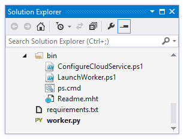
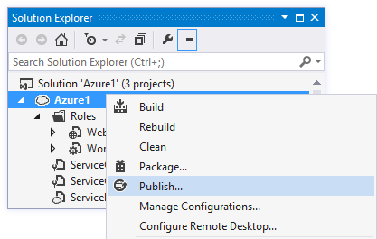

Microsoft Azure Cloud Service Projects
======================================

Microsoft Azure Cloud Services can be written in Python, and Python Tools for Visual Studio includes templates to help you get started.

This page is an overview of the support available in PTVS. Visit the [Python Developer Center](http://go.microsoft.com/fwlink/?linkid=254360) for more in-depth coverage of writing Python services on Azure.

What is a Cloud Service?
------------------------

Cloud Service is a model of an application that consists of multiple *roles*.
Each role performs a conceptually separate task, but may be replicated in order to provide scaling.
A cloud project may have any number of roles, and deploying the project will instantiate as many virtual machines as required.

Visit the [Cloud Service documentation](http://go.microsoft.com/fwlink/?LinkId=306052) for more details.

Roles
-----

Microsoft Azure Cloud Service supports two different kinds of roles: *web* and *worker*.

Web roles are intended for hosting front-end web applications.
For Python, any web framework that supports WSGI can be used to write this application.
See our [Python Web Projects](Web-Project) page for information about writing a web application using PTVS.

Worker roles are intended for long-running processes that do not interact directly with users.
They will typically make use of the [data](http://go.microsoft.com/fwlink/?LinkId=401571) and [app service](http://go.microsoft.com/fwlink/?LinkId=401572) libraries, which may be installed with `pip install`&nbsp;[`azure`](http://pypi.python.org/pypi/azure).

Create
======

To start creating your project, select the Azure Cloud Service template from the New Project dialog.
If you have not installed the Azure SDK Tools for Visual Studio, you will be prompted to install them now.

In the next dialog that appears, you may select one or more roles to include.
Cloud projects may combine roles written in different languages, so you can easily write each part of your application in the most suitable language.
To add new roles to the project after completing this dialog, you can right click 'Roles' in Solution Explorer and select one of the items under 'Add'.

**Important:**
After adding a new role to your Cloud project, you may be presented with some more configuration instructions.
If you are using Microsoft Azure Tools 2.4 or later, these instructions may not apply, and if you add multiple roles at the same time, you may not see all of the instructions.
The instructions and troubleshooting tips are available in the readme.mht file in each new role.

In your role projects, you will see a `bin` directory containing one or two PowerShell scripts.
These are used to configure the remote machine, including installing Python, any [WebPI references](#webpi-references) or [requirements.txt](#requirementstxt) file in your project, and setting up IIS if necessary.
These files may be freely edited to customize your deployment, though most common options can be managed in other ways (see [Configure](#configure) below).
We do not suggest removing these files, as a legacy configuration script will be used instead if they are not available.
To add these files to an existing project, add the Web Role Support Files or Worker Role Support Files item under Add New Item.

Configure
=========
While the code above and the included PowerShell scripts may be edited freely, it is possible to set most configuration options through your Python project.

To specify the version of Python your worker should run with, make it the active environment for your project.
(Ensure that you have a WebPI reference or startup task to install this version on the instance - see the documentation in `ConfigureCloudService.ps1` for more details.)

If your version of Python cannot be detected using the CPython registry keys after it has been installed, you can add the `DeployedPythonInterpreterPath` property to your Python project by editing the .pyproj file.
This path will take precedence over the active environment.

To install packages using pip, update the `requirements.txt` file in the root directory of your project.

To set `PYTHONPATH` (or equivalent) before running the worker, add the necessary Search Paths to your project.
Other environment variables can be set by modifying `LaunchWorker.ps1` (worker role) or the automatically-generated `web.config` file (web role).

To specify the script to run in a worker role, or to specify your main handler script in a web role, make it the startup file in your project.
Alternatively, you can modify `LaunchWorker.ps1` (worker role) or set the full importable name of your WSGI app in Project Properties\Web\WSGI Handler (web role).

To specify command-line arguments for a worker role, add them to the Command Line Arguments property under Project Properties\Debug.

Test
====

While writing your roles, you can test your Cloud project locally using the Cloud Service Emulator.
The emulator is included with the Azure SDK Tools and is a limited version of the environment used when your Cloud Service is published to Azure.
To start the emulator, ensure your Cloud project is the startup project and press F5 or Ctrl+F5.

Note that, due to limitations in the emulator, it is not possible to debug your Python code.
We recommend you debug roles by running them independently of the emulator, and then use the emulator for integration testing before publishing.

Deploy
======

A project can be deployed to a Microsoft Azure Cloud Service by selecting the Cloud project, then selecting Publish from the Build menu.
You can also right-click the project and select Publish.
(Note that the Publish menu on a Python project is not the same sort of publish.)

Publishing occurs in two phases.
The first is packaging, which runs on your development machine and produces a single package containing all the roles for your Cloud Service.
This package is deployed to Microsoft Azure, which will initialize one or more virtual machines for each role and deploy the source.

As each virtual machine activates, it will execute the `ConfigureCloudService.ps1` script and install any dependencies.
Finally, worker roles will execute `LaunchWorker.ps1`, which will start running your Python script, while web roles will initialize IIS and begin handling web requests.

Dependencies
------------

There are two ways in which dependencies can be provided through the configuration script.

### WebPI References

WebPI references can be used when deploying to Cloud Service to automatically install dependencies.
A custom feed can be used to define your own dependencies, other than the ones included in the default feed.
See the [documentation on TechNet](http://technet.microsoft.com/en-us/library/ee424350(v=ws.10).aspx) for information on the WebPI feed schema.

If you do not specify any WebPI references and your project is using Python 2.7 or Python 3.4, a reference will automatically be added for the 32-bit version of the interpreter.
To use another version of Python, you will need to create a custom feed with installation information for your interpreter, or define the `SuppressGenerateWebPiReference` property in your project.
You can also add another startup task to your `ServiceDefinition.csdef` file and deploy the installer with your project.

WebPI will be downloaded automatically if necessary, which may count as chargeable bandwidth usage.
To include WebPI as part of your deployment, download the installer and add it to the bin directory alongside `ConfigureCloudService.ps1`.
The installer must be named `WebPlatformInstaller_x86_en-US.msi` or `WebPlatformInstaller_amd64_en-US.msi` depending on the architecture of the remote machine.

### Requirements.txt

For Cloud Service, the `ConfigureCloudService.ps1` script is able to use pip to install a set of dependencies.
These should be specified in a file named `requirements.txt` (customizable by modifying `ConfigureCloudService.ps1`).
The file is executed with `pip -r requirements.txt` as part of initialization.

Note that Cloud Service instances do not include C compilers, so all libraries with C extensions must provide precompiled binaries.

See [Virtual Environments](Python-Environments#managing-required-packages) for more information on managing `requirements.txt` files.

pip and its dependencies, as well as the packages in `requirements.txt`, will be downloaded automatically and may count as changeable bandwidth usage.
To include your dependencies as part of your deployment, create a virtual environment on your local machine and change the Build Action of your `requirements.txt` file to **None**.
This will prevent it from being deployed and executed on the instance.

Troubleshooting
---------------

If your web or worker role does not behave correctly after deployment, check the following:

* Your Python project includes a bin\ folder with (at least):
 * `ConfigureCloudService.ps1`
 * `LaunchWorker.ps1` (for worker roles)
 * `ps.cmd`

* Your Python project includes either:
 * a `requirements.txt` file listing all dependencies, OR
 * a virtual environment containing all dependencies.

* Enable Remote Desktop on your Cloud Service and investigate the log files.

* Logs for `ConfigureCloudService.ps1` and `LaunchWorker.ps1` are stored in the following path on the remote machine:
 * `C:\Resources\Directory\%RoleId%.DiagnosticStore\LogFiles`

* Currently, the `LaunchWorker.ps1.log` file is the only way to view output or errors displayed by your Python worker role.

If you are still having trouble, start a discussion at [our discussion forum](http://go.microsoft.com/fwlink/?LinkId=293415) for further help.

