Debugging
=========

Python Tools includes integrated support for debugging multiple types of Python applications including attaching to Python processes, evaluating Python expressions in the watch and immediate windows, and inspecting local variables, step in, out, and over statements, set the next statement, and breaking on exceptions.

This section provides a brief overview of debugging in Visual Studio, and details the extensions provided by PTVS.

Basic Debugging
---------------

To access full debugging support in PTVS, you will need to be using a project. (See [Projects](Projects) for information on creating and using project.) With a project, you can associate debugging settings with your script, including a startup file and command-line arguments. These options will prevent you from needing to start your programs from the command line. See [Debugging with a Project](#debugging-with-a-project) for information about modifying these settings, and [Debugging without a project](#debugging-without-a-project) for information on using the debugger without creating a project.

However, with or without a project, many of the same principles apply. These are common to all languages in Visual Studio.

### Breakpoints

Breakpoints, as shown in the image to the right, are lines of code where the debugger should stop executing and allow you to investigate the program state. They can be set by clicking in the margin of the code editor, or by right-clicking on a line of code and selecting Breakpoint, Insert Breakpoint.

Some breakpoints in Python can be surprising for those who are used to other languages. When loading a source file, Python will execute the file to create any top-level class or function definitions. If a breakpoint has been set, you may find the debugger breaking part-way through a class declaration. In Python, the entire file is executable code, so this is the correct, if unexpected, behavior.

If you want to set a breakpoint that only breaks under certain circumstances, you can set a condition. To do this, set the breakpoint, then right-click on the dot in the margin and select "Condition". In this dialog, you can provide a Python expression to evaluate each time the breakpoint is hit. If the expression is not True, or has not changed, the debugging will continue executing.

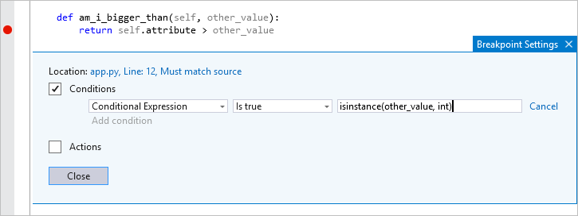

(Note that if the expression has side-effects then it may affect the behavior of your program.)

If you don't ever want to break at a breakpoint, you can convert it into a tracepoint. Right-click the dot in the margin and select "When Hit". The dialog will allow you to specify a message to be written to the Output Window, including values of any variable that would be accessible at that point.

Breakpoints can be cleared by clicking on the dot in the margin, or through the Breakpoints window (Debug, Windows, Breakpoints).

### Stepping

Once you've broken into the debugger, you can step through your code one statement at a time. The step commands include Step Into, Step Over, and Step Out.

Step Into will execute the next statement and stop. If the next statement is a call to a function, the debugger will stop at the first line of the function being called. Check the Debug, Step Into menu to find the keyboard shortcut to use to step (typically F11).

Step Over will execute the next statement, but if it is a call to a function then the entire function will be executed. This allows you to easily skip functions when you are not interested in debugging them. Check the Debug, Step Over menu to find the keyboard shortcut (typically F10).

Step Out will execute until the end of the current function. It is useful when there is nothing else interesting in the current function. Check the Debug, Step Out menu to find the keyboard shortcut (typically Shift+F11).

If you want to continue running, press F5. Your program will not break until the next breakpoint. Note that when you Step Over or Step Out, if the running code hits a breakpoint it will break again, even if it has not reached the end of the function.

### Inspecting values

While your program is broken in the debugger, you can view the contents of local and global variables using DataTips or the Watch windows.

To view a value using DataTips, simply hover the mouse over any variable in the editor.

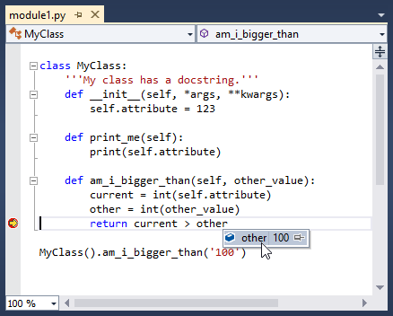

While debugging, you can also inspect variables using the Locals window and the Watch windows. The Locals window (Debug, Windows, Locals) contains all variables that are in the current scope.

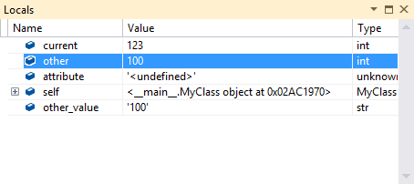

The Watch windows (Debug, Windows, Watch, Watch 1-4) allow you to enter arbitrary Python expressions and view the results. These will be reevaluated for each step.

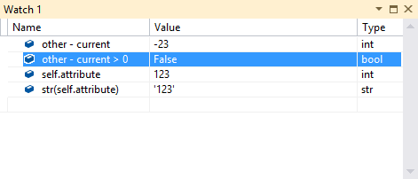

When a value being inspected is a string (`str`, `unicode`, `bytes` and `bytearray` are all considered strings for this purpose), you will see a magnifying glass icon on the right side of the value. Clicking on it will display the unquoted string value in a popup dialog, with wrapping and scrolling, which is useful for long strings. In addition, clicking on the drop-down arrow on the icon will allow you to select the visualization mode that you want to use: plain text, HTML, XML, and JSON. 

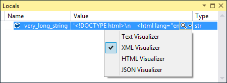

In HTML mode, an embedded browser instance will be used to render the HTML code in the string. In XML and JSON modes, there is syntax highlighting for the corresponding markup, and you can expand and collapse individual nodes in the tree. 

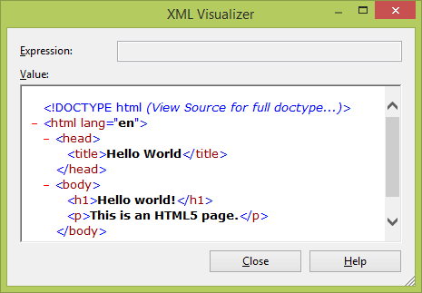

### Exceptions

If an error occurs while your program is being debugged, and you don't have an exception handler for it, the debugger will break and show you the error.

Now the debugger can be used to inspect the current state, including variables and the traceback. If you continue or step, the exception will continue being thrown until it is either handled or your program exits.

If you are being interrupted often by the debugger breaking on exceptions, or if the debugger is not breaking on some exceptions that you would like it to break on, you can modify the settings in the Exceptions dialog. On the Debug menu, click Exceptions, and expand the Python Exceptions entry. Here you can see all the exceptions that are already know and can be configured.

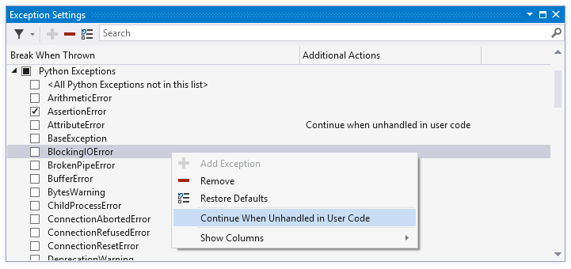

The left-hand checkbox ("Thrown") for each exception controls whether the debugger *always* breaks when it is raised. You should check this box when you want to break more often for a particular exception.

The right-hand checkbox ("User-unhandled") controls whether the debugger breaks whenever there is no catch statement in your code to handle the exception (or when the debugger fails to find a catch statement, which can happen if there is no source code available for a module). You should uncheck this box when you want to break less often for an exception.

To configure an exception that does not appear in this list, click the Add button to add it. The name must match the full name of the exception precisely.

Debugging with a Project
------------------------

With a project, there are two options for starting debugging. The simplest is to press F5 (Debug, Start Debugging), which will launch your startup file (which is shown in **bold** in Solution Explorer) with the project's active environment (also shown in bold) and any command-line arguments or search paths that have been specified.

Alternatively, you can right-click any Python file in Solution Explorer, or an open editor window, and select Start with Debugging. This will run the file with all the settings in the project.

Pressing Ctrl+F5, or selecting Start without Debugging will execute the file without attaching the debugger. Often, programs will run faster without the debugger attached, and starting it with these commands will also use the project settings.

### Active Environment

See [Python Environments](Python-Environments) for a full description of how to use environments.

The active environment is shown in bold in Solution Explorer. (If you have no items listed under Python Environments, then your default environment is considered active.) This environment contains the interpreter and libraries that your program will run with.

To run your program with a different environment, you should add it to your project and make it active. This will ensure that the code completions and error messages given in the editor are valid for the version of Python you intend to use.

### Command-line Arguments

To launch your script with certain command-line arguments, provide them as a Debug property.

Right-click on your project and choose Properties, then select the Debug tab. Here, you can provide the following options (for the standard launcher; see [Launch Modes](#launch-modes) for information about other launchers):

* Search Paths
* Script Arguments
* Interpreter Arguments
* Interpreter Path

The Search Paths setting matches what is shown in Solution Explorer. While you can modify this value here, it is simpler to use the other interface, which will allow you to browse for a folder.

Script Arguments are the most useful option. This text will be added to the command used to launch your script, appearing after your scripts name. The first item here will be available to your script as `sys.argv[1]`, the second as `sys.argv[2]`, and so on.

Interpreter Arguments are arguments for the interpreter itself, and appear before the name of your script. Common arguments here are `-W ...` to control warnings, `-O` to slightly optimize your program, and `-u` to use unbuffered IO. IronPython users can use this field to pass `-X` options, such as `-X:Frames` or `-X:MTA`.

The Interpreter Path setting will override the path associated with the current environment. This may be useful for launching your script with a non-standard interpreter.

### Launch Modes

Multiple debugging modes are provided to enable different scenarios. Generally, there is no need to change these. However, in some situations, it is useful to modify the launch mode of your project.

Right click on your project and choose Properties (Alt+Enter). From the Debug tab, you can choose one of four launchers:

* Standard Python launcher
* IronPython (.NET) launcher
* MPI Cluster launcher
* Django launcher

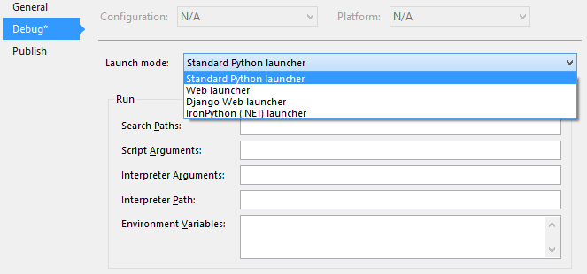

The standard launcher uses debugging code written in portable Python code that is compatible with CPython, IronPython, and variants such as Stackless Python. It provides the best experience for debugging pure Python code. When you attach to a running `python.exe` process, this launcher is used. This launcher also provides mixed-mode debugging for CPython, allowing you to step seamlessly between C/C++ code and Python code. See [Mixed-mode debugging](Mixed-Mode-Debugging) for details on using this mode.

The IronPython launcher uses the .NET debugger, which only works with IronPython but allows for stepping between any .NET language project, including C# and VB. If you attach to a running .NET process that is hosting IronPython, this mode is used.

The MPI Cluster launcher is for remotely debugging Python processes. See the [wiki:"HPC and Cloud Features" Detailed Walk-thu Guide - HPC and Cloud Features] overview for more information.

The Django launcher starts your default browser on launch and enables debugging of templates. See the [Python Developer Center](https://www.windowsazure.com/en-us/develop/python/) on [windowsazure.com](http://windowsazure.com) for more information.

The Standard debugger basically works just like the VS debugger. The IronPython debugger uses the .Net debugger and allows you to debug into multi-lingual .Net projects in C#, VB, F#, ... The Python MPI Debugger supports debugging across remote processes on an HPC cluster (discussed elsewhere).

Debugging without a Project
---------------------------

If you do not have a project, you can debug the script you current have open by right-clicking in the editor and selecting "Start with Debugging".

This will launch your script with your global default environment (see [Python Environments](Python-Environments) for information on setting your default environment) and will not use any command-line arguments. However, once debugging has started, the full functionality is available.

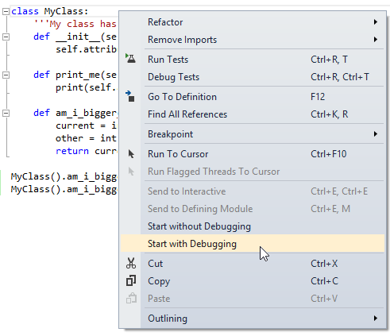

The Debug Interactive Window
----------------------------
Python Tools for Visual Studio includes an interactive window for debugging your code. You can launch the window through Debug, Windows, and selecting Python Debug Interactive. The debug interactive window is similar to the immediate window, but providing full Python support and running code directly against the debuggee.

The Debug Interactive window automatically connects to any process started in the debugger using the Standard Python launcher, including processes attached through Debug, Attach to Process. The Debug Interactive window is not available when using mixed-mode C/C++ debugging.

Code can be executed in the Debug Interactive window whenever the debuggee is broken. You cannot evaluate code while the process is running.

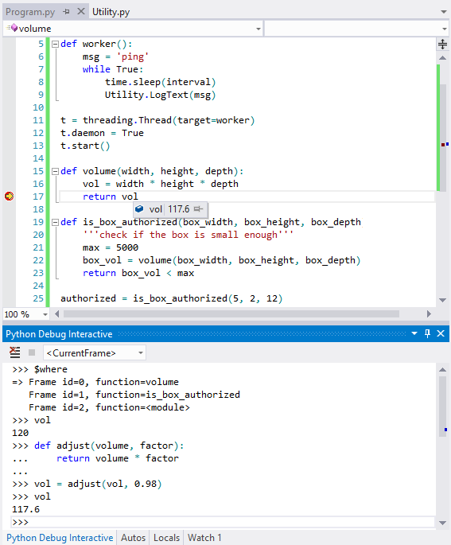

The debug interactive window supports several commands that are not part of Python. All commands start with a `$`, and you can type `$` or `$help` to get a list of the meta commands. Here are some of the most important commands.

<table style="border-spacing:0; border-collapse:collapse">
<tbody>
<tr>
<td style="padding:0.2em 0.5em; border:1px solid #a0a0a0"><strong>Command</strong></td>
<td style="padding:0.2em 0.5em; border:1px solid #a0a0a0"><strong>Arguments</strong></td>
<td style="padding:0.2em 0.5em; border:1px solid #a0a0a0"><strong>Description</strong></td>
</tr>
<tr>
<td style="padding:0.2em 0.5em; border:1px solid #a0a0a0"><code>$procs</code></td>
<td style="padding:0.2em 0.5em; border:1px solid #a0a0a0"></td>
<td style="padding:0.2em 0.5em; border:1px solid #a0a0a0">Lists the processes currently being debugged.</td>
</tr>
<tr>
<td style="padding:0.2em 0.5em; border:1px solid #a0a0a0"><code>$proc</code></td>
<td style="padding:0.2em 0.5em; border:1px solid #a0a0a0">process id</td>
<td style="padding:0.2em 0.5em; border:1px solid #a0a0a0">Switches the current process to the specified process id.</td>
</tr>
<tr>
<td style="padding:0.2em 0.5em; border:1px solid #a0a0a0"><code>$proc</code></td>
<td style="padding:0.2em 0.5em; border:1px solid #a0a0a0"></td>
<td style="padding:0.2em 0.5em; border:1px solid #a0a0a0">Displays the current process id.</td>
</tr>
<tr>
<td style="padding:0.2em 0.5em; border:1px solid #a0a0a0"><code>$mod</code></td>
<td style="padding:0.2em 0.5em; border:1px solid #a0a0a0">module name</td>
<td style="padding:0.2em 0.5em; border:1px solid #a0a0a0">Switches the current scope to the specified module name. This can also be done using the toolbar. The active module automatically changes back to &lt;CurrentFrame&gt; when execution breaks into the debugger.</td>
</tr>
<tr>
<td style="padding:0.2em 0.5em; border:1px solid #a0a0a0"><code>$threads</code></td>
<td style="padding:0.2em 0.5em; border:1px solid #a0a0a0"></td>
<td style="padding:0.2em 0.5em; border:1px solid #a0a0a0">Lists the threads currently being debugged.</td>
</tr>
<tr>
<td style="padding:0.2em 0.5em; border:1px solid #a0a0a0"><code>$thread</code></td>
<td style="padding:0.2em 0.5em; border:1px solid #a0a0a0">thread id</td>
<td style="padding:0.2em 0.5em; border:1px solid #a0a0a0">Switches the current thread to the specified thread id.</td>
</tr>
<tr>
<td style="padding:0.2em 0.5em; border:1px solid #a0a0a0"><code>$thread</code></td>
<td style="padding:0.2em 0.5em; border:1px solid #a0a0a0"></td>
<td style="padding:0.2em 0.5em; border:1px solid #a0a0a0">Displays the current thread id.</td>
</tr>
<tr>
<td style="padding:0.2em 0.5em; border:1px solid #a0a0a0"><code>$where,w,bt</code></td>
<td style="padding:0.2em 0.5em; border:1px solid #a0a0a0"></td>
<td style="padding:0.2em 0.5em; border:1px solid #a0a0a0">Lists the frames for the current thread.</td>
</tr>
<tr>
<td style="padding:0.2em 0.5em; border:1px solid #a0a0a0"><code>$frame</code></td>
<td style="padding:0.2em 0.5em; border:1px solid #a0a0a0">frame id</td>
<td style="padding:0.2em 0.5em; border:1px solid #a0a0a0">Switches the current frame to the specified frame id.</td>
</tr>
<tr>
<td style="padding:0.2em 0.5em; border:1px solid #a0a0a0"><code>$frame</code></td>
<td style="padding:0.2em 0.5em; border:1px solid #a0a0a0"></td>
<td style="padding:0.2em 0.5em; border:1px solid #a0a0a0">Displays the current frame id.</td>
</tr>
<tr>
<td style="padding:0.2em 0.5em; border:1px solid #a0a0a0"><code>$up,u</code></td>
<td style="padding:0.2em 0.5em; border:1px solid #a0a0a0"></td>
<td style="padding:0.2em 0.5em; border:1px solid #a0a0a0">Move the current frame one level up in the stack trace.</td>
</tr>
<tr>
<td style="padding:0.2em 0.5em; border:1px solid #a0a0a0"><code>$down,d</code></td>
<td style="padding:0.2em 0.5em; border:1px solid #a0a0a0"></td>
<td style="padding:0.2em 0.5em; border:1px solid #a0a0a0">Move the current frame one level down in the stack trace.</td>
</tr>
<tr>
<td style="padding:0.2em 0.5em; border:1px solid #a0a0a0"><code>$continue,cont,c</code></td>
<td style="padding:0.2em 0.5em; border:1px solid #a0a0a0"></td>
<td style="padding:0.2em 0.5em; border:1px solid #a0a0a0">Starts executing the program from the current statement.</td>
</tr>
<tr>
<td style="padding:0.2em 0.5em; border:1px solid #a0a0a0"><code>$stepin,step,s</code></td>
<td style="padding:0.2em 0.5em; border:1px solid #a0a0a0"></td>
<td style="padding:0.2em 0.5em; border:1px solid #a0a0a0">Steps into the next function call, if possible.</td>
</tr>
<tr>
<td style="padding:0.2em 0.5em; border:1px solid #a0a0a0"><code>$stepout,return,r</code></td>
<td style="padding:0.2em 0.5em; border:1px solid #a0a0a0"></td>
<td style="padding:0.2em 0.5em; border:1px solid #a0a0a0">Steps out of the current function.</td>
</tr>
<tr>
<td style="padding:0.2em 0.5em; border:1px solid #a0a0a0"><code>$stepover,until,unt</code></td>
<td style="padding:0.2em 0.5em; border:1px solid #a0a0a0"></td>
<td style="padding:0.2em 0.5em; border:1px solid #a0a0a0">Steps over the next function call.</td>
</tr>
</tbody>
</table>

Note that the standard debugger windows such as Processes, Threads and Call Stack are not synchronized with the Debug Interactive window. This means that changing the active process, thread, or frame in the Debug Dnteractive window will not affect the other debugger windows, and similarly, changing the active process, thread, or frame in the other debugger windows will not affect the debug interactive window.

The debug interactive window has its own set of options, which you can access through Tools, Options, Python Tools, Debug Interactive Window. Unlike the regular Python Interactive window, which has a separate instance for each Python environment, there is only one Debug Interactive window and it always uses the Python interpreter for the process being debugged.

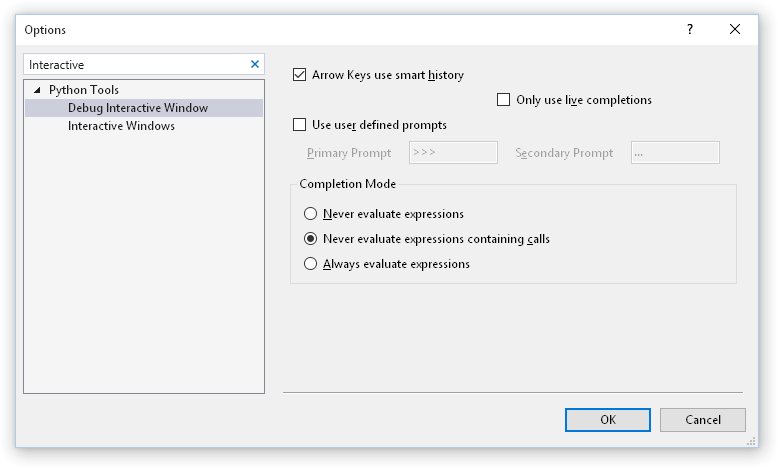
