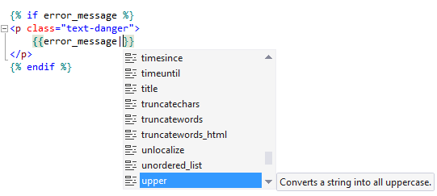
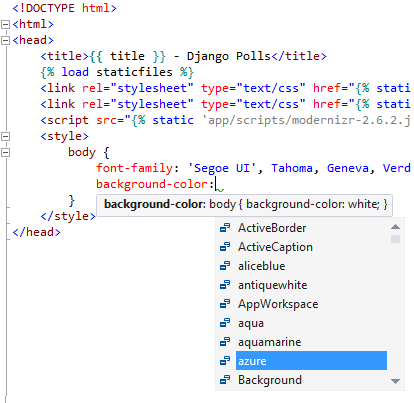
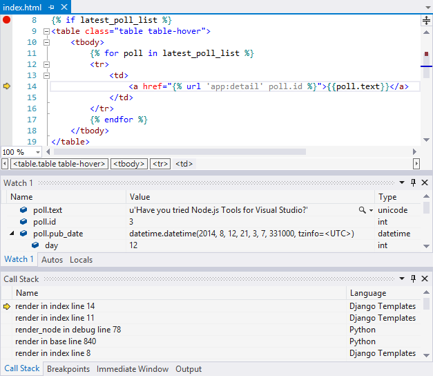
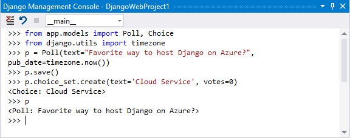

Django
======

This section provides an overview of features specific to Django web projects in Visual Studio.

Template Editing
----------------

### IntelliSense

The Django template editor understands the context variables passed into the 
template and makes them available as completions.

Django tags and filters (builtins and user defined) are also available.

### Embedded CSS IntelliSense

Syntax coloring and IntelliSense is now available for embedded CSS and JavaScript.

Template Debugging
------------------

[Standard debugging features](Debugging) such as Breakpoints, Stepping and Inspecting values are available for Django templates.

Django Management Console
-------------------------

The following commands are available under the "Project" menu or the "Python" context menu that appears when you right-click your project in Solution Explorer.

### Django Shell

The "Open Django Shell" command opens a shell in your application context which enables you to manipulate your models.

### Sync DB

The "Django Sync DB" command executes `manage.py syncdb` in an interactive window.

### Collect Static

The "Collect Static Files" command executes `manage.py collectstatic --noinput`.

This copies all the static files to the path specified by `STATIC_ROOT` in your `settings.py`.

### Validate

The "Validate Django App" command executes `manage.py validate`.

This will report any validation errors in the installed models specified by `INSTALLED_APPS` in your `settings.py`.

Microsoft Azure
---------------

### Publishing

When [publishing to Microsoft Azure](Web-Project#publishing-to-microsoft-azure), static files are automatically collected as part of the publish operation.

### Tutorials

See the following tutorials for examples of using PTVS to create Django applications for Microsoft Azure.

 * [Django and SQL Database on Azure](Django-and-SQL-Database-on-Azure)
 * [Django and MySQL on Azure](Django-and-MySQL-on-Azure)
