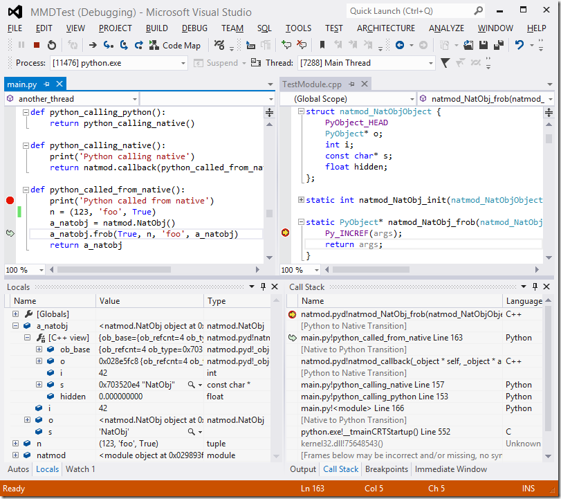
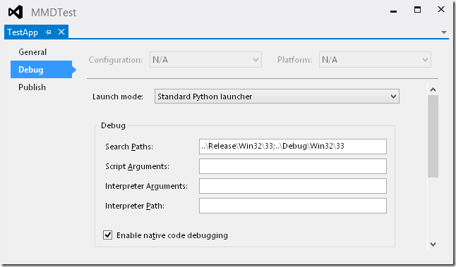
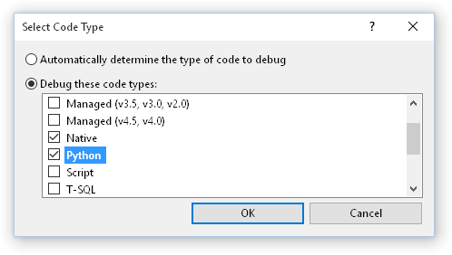
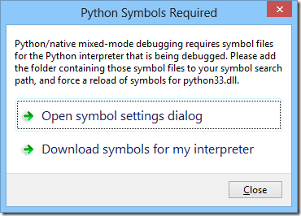
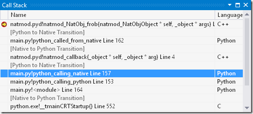
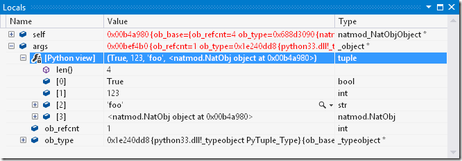
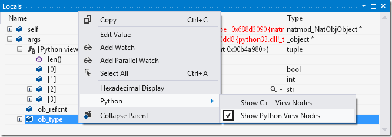
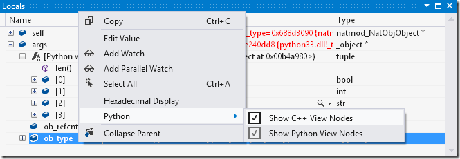
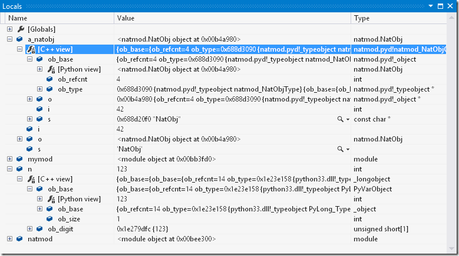

# Mixed-mode debugging

For a ten minute introduction to building, testing and debugging native C modules with Visual Studio, see this video.

[](https://youtu.be/D9RlT06a1EI)

## Introduction

Most regular Python debuggers, including PTVS before version 2.0, only support debugging of Python code. In practice, however, Python is often used in conjunction with C or C++ where high performance or the ability to directly invoke platform APIs is required. Python Tools for Visual Studio provides integrated debugging experience for such scenarios, where Python and native (C/C++) code is debugged simultaneously in a single Visual Studio debugging session, with combined call stacks, the ability to step between Python and native code, breakpoints in either type of code, and the ability to see Python representations of objects in native frames and vice versa:

 

## Differences from pure Python debugging

The mixed-mode debugger is completely distinct from conventional pure Python debuggers. This was necessitated by the unique challenges of supporting mixed mode, but it also means that the experience is different from the [regular PTVS debugger](Debugging), and is more feature-limited in some areas that pertain to pure Python debugging, while providing additional features that are primarily or only useful in mixed mode. Because of this, the conventional debugging experience remains available, and is used by default when debugging Python project. The remainder of this section will describe the differences and limitations of mixed mode in more detail.


### Supported Python versions

The pure Python debugger supports most Python interpreters that provide the standard Python debugging API - CPython, PyPy, IronPython, Jython etc. Mixed-mode debugging, in contrast, requires intimate understanding of interpreter internals, and so it is only supported for CPython 2.7 and 3.3+. Additionally, mixed-mode debugging requires debug symbols for that particular Python interpreter binary (python27.dll or python33.dll) to be available, and so it is not available for third-party CPython distributions that do not provide symbols for their binaries. Our [symbols list](Symbols-for-Python-mixed-mode-debugging) explains the requirements for debug symbols in more detail, as well as how to obtain them.


### Supported Visual Studio versions

Mixed-mode debugging is supported on all editions of Visual Studio.

When using PTVS with Visual Studio Shell (for example, if you installed it using the integrated installer), Visual Studio is unable to open C++ projects, and editing experience for C++ files is that of a basic text editor - no syntax highlighting nor code completion is available. However, C/C++ debugging, as well as Python mixed-mode debugging, is still fully supported in Shell, and will show the source code, provide stepping in native code, and provide C++ expression evaluation in debugger windows.

If want to author Python native extension modules, we recommend that you install the free [Visual Studio Community Edition](http://visualstudio.com). This will allow you to conveniently edit your C++ code and build it in the same solution.


### Expression evaluation

The pure Python debugger allows evaluation of arbitrary Python expressions in Watch and Immediate windows when the debugged process is paused at any point in the code, so long as it is not blocked in an I/O operation or other similar system call. Mixed-mode debugging imposes some additional constraints: arbitrary expressions can only be evaluated when stopped in Python code, either after hitting a breakpoint in it, or after stepping into it, and expressions can only be evaluated on the thread on which the breakpoint or the stepping operation occurred.

When stopped in native code, or in Python code where the conditions above do not apply (e.g. after a step-out operation, or on a different thread), the ability to evaluate expressions is limited to accessing local and global variables in scope of the currently selected frame, accessing their fields, and indexing built-in collection types with literals. For example, the following expression can be evaluated in any context (provided that all identifiers refer to existing variables and fields of appropriate types):

```python
foo.bar[0].baz['key']
```

The way identifiers are resolved in such expressions is also different. All member access operations only look up fields that are physically a part of the object (i.e. an entry in its `__dict__` or `__slots__`, or a field of a native struct that is exposed to Python via `tp_members`), and ignore any `__getattr__`, `__getattribute__` or descriptor logic. Similarly, all indexing operations ignore `__getitem__`, and access the inner data structures of collections directly.

For the sake of consistency, this name resolution scheme used for all expressions that match the constraints for limited expression evaluation, regardless of whether arbitrary expressions are allowed at the current stop point or not. To force proper Python semantics when a full-featured evaluator is available, enclose the expression in parentheses, e.g.:

```python
(foo.bar[0].baz['key'])
```


### Viewing and expanding objects

When viewing Python objects in the Locals and Watch debugger tool windows, mixed-mode debugger only shows physical structure of the objects. It does not automatically evaluate properties, or show computed attributes. For collections, it only shows elements for built-in collection types (`tuple`, `list`, `dict`, `set`). Custom collection types are not visualized as collections, unless they are inherited from some built-in collection type.


### Unsupported features

Conditional breakpoints are not supported in mixed mode.

[The Debug Interactive window](Debugging#the-debug-interactive-window) is not supported in mixed mode. The Immediate window provides a limited subset of its functionality, and is available, but with all the caveats described in the section above.

[Cross-platform remote debugging](Cross-Platform-Remote-Debugging) is not supported in mixed mode.


## Enabling mixed-mode debugging

To use the mixed-mode debugger instead of the pure Python one when debugging a project, open project properties for the Python project via the context menu of the project node in Solution Explorer, open the "Debug" tab, and check the "Enable native code debugging" checkbox:



With this setting enabled, mixed-mode debugger will be used whenever the project is launched with debugging (Debug -> Start Debugging, or F5 with default key bindings).

When attaching the debugger to an existing process, mixed-mode debugging can be enabled by checking both Native and Python at the same time in the "Code Type" dialog. To open it, on the "Attach to Process" dialog, click "Select...":



Note that this setting persists, so if you want to disable mixed-mode debugging when attaching to a different process later, you’ll need to repeat these steps and uncheck the Python code type.

It is possible to select other code types in addition to, or instead of, Native. For example, if a managed application hosts CPython, which in turn uses native extension modules, and you want to debug all three, you can check Python, Native and Managed at the same time to get a unified debugging experience with combined stacks transparent stepping between all three runtimes.


## Python symbols required

When you start debugging in mixed mode for the first time, you will likely see this dialog:



The detailed steps to obtain the symbols for your interpreter and register it with Visual Studio are available on our [symbols list](Symbols-for-Python-mixed-mode-debugging) (the "Download symbols" link in the dialog will open it as well). This only has to be done once for every Python interpreter version that you will be using.


## Mixed-mode specific features

### Combined call stack



The Call Stack tool window shows both native and Python stack frames interleaved, and also marks transitions between the two. Note that transitions will show up as "[External Code]", without specifying the direction of transition, if "Just My Code" is enabled. This option can be configured in Tools -> Options -> Debugging -> General -> Enable Just My Code.

Double-click any frame to make it active, and open the corresponding line of code in the editor. Note that in some cases, the mapping to source code cannot be established (for example, when the stack frame corresponds to an `eval` call) - the frame will still be made active in this case, and its local variables can be inspected, but the editor will not open.


### Python view of `PyObject` values in native code

When a native (C or C++) frame is active, its local variables show up in the debugger Locals window. In native Python extension modules, many of these are of type `PyObject` (which is a typedef for `_object`), or a few other fundamental Python types. If mixed-mode debugging is enabled, all values of those types will present an additional child node when expanded, which shows their Python representation:



This representation is identical to what you’d see if a local variable referencing the same object was present in a Python frame. It is not possible to edit the node itself, but its children are editable, so you can change fields of objects, elements of collections etc that way.

"[Python View]" nodes show by default, but they can be disabled if desired by right-clicking anywhere inside the Locals window, and toggling Python -> Show Python View Nodes:



The following C types will show "[Python View]" nodes if they are enabled:

- `PyObject `
- `PyVarObject`
- `PyTypeObject`
- `PyByteArrayObject`
- `PyBytesObject`
- `PyTupleObject`
- `PyListObject`
- `PyDictObject`
- `PySetObject`
- `PyIntObject`
- `PyLongObject`
- `PyFloatObject`
- `PyStringObject`
- `PyUnicodeObject`

You will not automatically get the "[Python View]" node for the types that you author yourself. When authoring extensions for Python 3.x, this is usually not an issue, because any object ultimately has an `ob_base` field of one of the types above, and that field will provide a "[Python View]" node for the entire object.

For Python 2.x, however, each object type typically declares its header as a collection of inline fields, and there is no association between custom authored types and `PyObject` at the type system level in C/C++ code. If it is still desired to enable "[Python View]" nodes for such custom types, it can be done by editing a file named `PythonDkm.natvis` in the [PTVS install directory](Where-is-PTVS-installed). It is an XML file that has a number of repeating entries that differ only by type name; adding another such entry with the name of your C struct or C++ class will enable "[Python View]" for it.

A better option is to follow [PEP 3123](http://www.python.org/dev/peps/pep-3123/) and use an explicit `PyObject ob_base;` field rather than `PyObject_HEAD`, though that may not always be possible for backwards compatibility reasons.


### C++ view of Python values in Python code

This feature is disabled by default; so as not to clutter debugger windows when in Python code. It can be enabled in the same context menu by toggling "Show C++ View Nodes".



Once enabled, all Python values (even primitives) in Python stack frames become expandable, and show a "[C++ View]" node as a child. This node provides a representation of the underlying C/C++ struct for this Python value - for example, it shows an instance of `_longobject` (for which `PyLongObject` is a typedef) for a Python long integer, and it will try to infer types for native classes that you have authored yourself:



This representation is identical to what you would see in a native frame for a variable of a corresponding type. The node itself cannot be edited, but all its fields are editable, so you can directly tweak data structures that are an implementation detail of your objects not directly exposed to Python. In addition, if a child field of an object is of type `PyObject`, or one of the other supported types, then it will have a "[Python View]" representation node (if those are enabled), making it possible to navigate object graphs where links are not directly exposed to Python.

Unlike Python View nodes, which use Python object metadata to determine the type of the object, there’s no similarly reliable mechanism for C++ View. Generally speaking, given a Python value - i.e. a `PyObject` reference - it is not possible to reliably determine which C/C++ struct is backing it. Mixed-mode debugger tries to guess that type by looking at various fields of the object’s type (i.e. the `PyTypeObject` referenced by its `ob_type` field) which have function pointer types. If one of those function pointers references a function that can be resolved, and that function has a "self" parameter with type more specific than `PyObject*`, then that type is assumed to be the backing type. For example, if `ob_type->tp_init` of a given object points at the following function:

```c
static int FobObject_init(FobObject* self, PyObject* args, PyObject* kwds) {
    return 0;
}
```

then debugger can correctly deduce that the C type of the object is `FobObject`. If it were unable to determine a more precise type from `tp_init`, it will move on to other fields. If it were unable to deduce the type from any of those fields, the "[C++ View]" node will present the object as a `PyObject` instance.

Therefore, in order to always get a useful representation for custom authored types, it is best to register at least one special function when registering the type, and use a strongly typed `self` parameter. Most types fulfill that requirement naturally; if that is not the case, then `tp_init` is usually the most convenient entry to use for this purpose. A dummy implementation of `tp_init` for a type that is present solely to enable debugger type inference can just return zero immediately, as in the code sample above.


### Stepping between Python and native

When using the Step Into (F11) or Step Out (Shift+F11) commands, the destination can be of a different code type than the origin, and this will be correctly handled. For example, when Python calls a method of a type that is implemented in C, stepping in on a call to that method will stop at the beginning of the native function implementing the method. Similarly, when native code calls some Python API function that results in Python code being invoked - for example, `PyObject_CallObject` on a function value that was originally defined in Python - stepping in on such a call will stop at the beginning of the Python function. Stepping in from Python to native is also supported for native functions invoked from Python via [ctypes](http://docs.python.org/3/library/ctypes.html).
